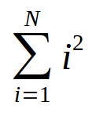

<meta http-equiv="Content-Type" content="text/html; charset=UTF-8"/></p>        

Roteiro 2: Expressões e Repetição
=================================

- Fazer todos os itens em um único arquivo, ex., `lab-02.py`.
- Ao final, enviar um e-mail da seguinte forma:
    - *Para*: `francisco@ime.uerj.br`
    - Enviar uma cópia para o seu e-mail.
      **Ao desligar, todos os arquivos são removidos do computador.**
    - *Assunto*: FDC, lab-02, João da Silva
    - *Anexos*:
        - `lab-02.py`
        - Para cada item, um *print screen* da tela de edição e outro da tela de execução
    - *Corpo*: Enumerar os exercícios que foram e não foram feitos, ex.:

```
Sim: 1 ao 3
Não: 4 e 5
Seguem arquivos em anexo...
```

## 1.

Faça um programa que leia o nome de um vendedor, o seu salário fixo e o total
de vendas efetuadas por ele no mês (em dinheiro).

Sabendo que este vendedor ganha 15% de comissão sobre suas vendas efetuadas,
informar o total a receber no final do mês.

## 2.

Escreva um programa que leia três números: A, B e C.

Em seguida, calcule e mostre:

- a área do triângulo retângulo que tem A por base e C por altura
- a área do círculo de raio C (pi = 3.14159)
- a área do trapézio que tem A e B por bases e C por altura
- a área do quadrado que tem lado B
- a área do retângulo que tem lados A e B.

## 3.

Faça um programa que leia números continuamente até que seja digitado `0`.
Ao final, o programa deve exibir a soma de todos os números lidos.

## 4.

Faça um programa que leia um número `N` e calcule o somatório a seguir:



## 5.

O Campeonato Brasileiro está na reta final com 20 times na disputa.

Uma vitória vale 3 pontos, um empate vale 1 ponto e uma derrota vale 0 pontos.
Escreva um programa que, para cada time, leia o nome, número de vitórias,
número de empates e número de derrotas.

Ao final, o programa deve escrever o nome dos times com mais e menos pontos até
o momento.
